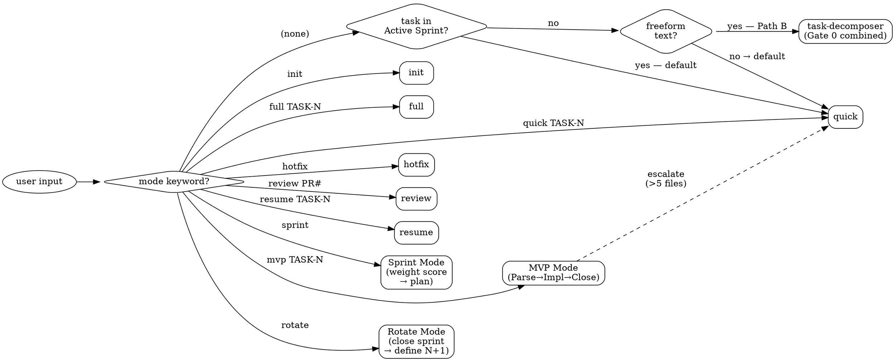

# dev-flow Orchestrator

Gate-driven workflow for any software task. Choose a mode, follow the phases, stop at every hard stop.

---

## Mode Dispatch

| Mode | Entry condition | Gates enforced |
|:-----|:----------------|:---------------|
| `init` | New project — no repo, no architecture | Gate A → Gate B → Gate C → Gate 1 → Gate 2 |
| `full` | Explicit `/dev-flow full TASK-N` — 10-phase run | Gate 0 → Gate 1 → Gate 2 |
| `quick` | **(default)** Bare `/dev-flow TASK-N`; ≤3 files expected | Gate 0 → Gate 2 (Gate 1 skipped) |
| `hotfix` | Production emergency | No gates — rollback check + lint warn only |
| `review` | Review existing code or open PR | Gate 2 only |
| `resume` | Interrupted session with an existing design plan | Resumes at first `[ ]` micro-task |
| `sprint` | Run all `[ ]` tasks in Active Sprint in one flow | Gate 0 per task → single Gate 2 per phase |
| `mvp` | Prototype/spike — no architecture needed | Gate 0: skip · Gate 1: skip · Gate 2: lint + existing tests green + commit |
| `rotate` | All Active Sprint tasks done — close sprint, archive, define N+1 | No gates — pre-condition check only |



**Freeform detection order** (orchestrator checks in order):
1. `/dev-flow rotate` → Rotate Mode (close sprint + archive + define N+1)
2. `/dev-flow sprint` → Sprint Mode (weight score → plan)
3. `/dev-flow [text that is not TASK-NNN and not a mode keyword]` → Path B (task-decomposer)
4. `/dev-flow` with no active tasks in TODO.md → Path B
5. `/dev-flow TASK-NNN` (no mode keyword) → quick mode (default)
6. `/dev-flow mvp TASK-NNN` → mvp mode (prototype/spike override)
7. `/dev-flow full TASK-NNN` → full mode (explicit override)

---

## Sub-commands

| Sub-command | Action | Script |
|:------------|:-------|:-------|
| `:compress <target-file>` | Compress target `.md` file to caveman prose in-place | `scripts/compress.py` |

---

## Phase Checklist — full detail in `${CLAUDE_SKILL_DIR}/references/phases.md`

| Phase | Name | Key action |
|:------|:-----|:-----------|
| 0 | Parse | `set-phase.js clear` pre-flight · read TODO.md |
| 1 | Clarify | batch all questions · await answers · iterate if unclear · no code changes |
| Gate 0 | Scope Confirmation | await `'design'` |
| 2 | Design | spawn `design-analyst` |
| Gate 1 | Design Plan Approval | await `'yes'` |
| 3 | Implement | `set-phase.js implement` |
| 4 | Validate | typecheck + lint → pass or **HARD STOP** |
| 5 | Test | `set-phase.js test` · RED-GREEN-REGRESS-REFACTOR |
| 6 | Review | `set-phase.js review` · spawn `code-reviewer` |
| 7 | Security | `set-phase.js security` · spawn `security-analyst` |
| Gate 2 | Aggregated Review + Security | await `'commit'` |
| 8 | Docs | `set-phase.js docs` · `/lean-doc-generator` |
| 9 | Commit + PR | `git commit` + `git push` + `set-phase.js clear` |
| 10 | Session Close | mandatory — never skip |

---

## Hard Stops — full list in `${CLAUDE_SKILL_DIR}/references/hard-stops.md`

```
❌ Gate 0 skipped — tracker "none" without justification
❌ Typecheck fails — show error, wait for fix
❌ Lint fails — show error, wait for fix
❌ CRITICAL finding (review or security) — require explicit override
❌ Session Close skipped — Phase 10 is mandatory after every commit
❌ CLAUDE.md exceeds 200 lines — trim before proceeding
❌ Sprint mode: ≥28 turns (≈70% budget) before next phase entry → prune first
```

Mode details: hotfix → `${CLAUDE_SKILL_DIR}/references/mode-hotfix.md` · resume → `${CLAUDE_SKILL_DIR}/references/mode-resume.md` · sprint → `${CLAUDE_SKILL_DIR}/references/mode-sprint.md` · mvp → `${CLAUDE_SKILL_DIR}/references/mode-mvp.md` · rotate → `${CLAUDE_SKILL_DIR}/references/mode-rotate.md`

---

## Red Flags — Rationalizations That Break the Workflow

| Rationalization | What it actually means |
|:----------------|:-----------------------|
| "This is small, Gate 0 is overkill" | Scope not confirmed — unconfirmed small changes cause large regressions |
| "Tests pass, the review agent is redundant" | Review catches spec drift that tests cannot — spec drift ships silently |
| "Session Close is just admin, let's skip" | Doc drift compounds — one skipped close creates three stale files |
| "Let's use hotfix for this non-emergency" | Hotfix disables all gates — reserve strictly for production-down |
| "We'll do a quick refactor inside this task" | Scope creep inside a task breaks Gate 1 — open a new task for refactors |
| "read-guard blocked a read — log it to BUGS.md" | read-guard blocks are enforcement events, not bugs. Never write block output to docs/. Resolve by dispatching the correct subagent or adding the path to ORCHESTRATOR_ALLOWLIST. |
