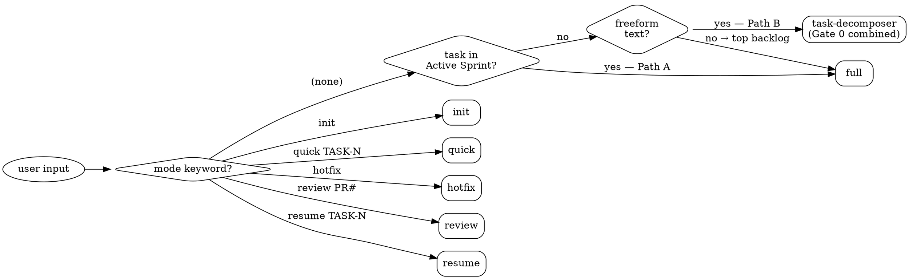

# dev-flow Orchestrator

Gate-driven workflow for any software task. Choose a mode, follow the phases, stop at every hard stop.

---

## Mode Dispatch

| Mode | Entry condition | Gates enforced |
|:-----|:----------------|:---------------|
| `init` | New project — no repo, no architecture | Gate A → Gate B → Gate C → Gate 1 → Gate 2 |
| `full` | Active task in TODO.md Active Sprint | Gate 0 → Gate 1 → Gate 2 |
| `quick` | Small task, ≤3 files expected | Gate 0 → Gate 2 (Gate 1 skipped) |
| `hotfix` | Production emergency | No gates — rollback check + lint warn only |
| `review` | Review existing code or open PR | Gate 2 only |
| `resume` | Interrupted session with an existing design plan | Resumes at first `[ ]` micro-task |



**Freeform detection order** (orchestrator checks in order):
1. `/dev-flow [text that is not TASK-NNN and not a mode keyword]` → Path B (task-decomposer)
2. `/dev-flow` with no active tasks in TODO.md → Path B
3. `/dev-flow` with active tasks → Path A (full mode)
4. `/dev-flow full TASK-NNN` → Path A explicit, skip decomposer

---

## Phase Checklist (full mode — Phases 0–10)

### Phase 0 — Parse
- [ ] Read TODO.md, find first `[ ]` task in Active Sprint
- [ ] Extract: task ID, title, `scope`, `layers`, `api-change`, `acceptance`, `tracker`
- [ ] `tracker` is "none" without justification → **HARD STOP**

### Phase 1 — Clarify
- [ ] Ask ONE question at a time — never stack multiple questions
- [ ] Stop when: goal clear, edge cases named, approach chosen
- [ ] **HARD RULE**: zero code or file changes during Clarify

### Gate 0 — Scope Confirmation
```
## Scope Confirmation — [TASK-NNN]: [Title]
**Understood goal**: [1 sentence]
**Chosen approach**: [which approach + why]
**Scope boundary**: [bullet list — what is included]
**Out of scope**: [explicitly excluded items]
**Edge cases to handle**: [list]
**Constraints**: Layers: [list] | API change: yes/no | Risk: low/medium/high
**Context cost estimate**: [Tier 2 — single layer | Tier 3 — cross-layer]
Type 'design' to proceed, or provide corrections.
```

### Phase 2 — Design
- [ ] Spawn `design-analyst` (background Tier 3) — **HARD STOP if Gate 0 not confirmed**
- [ ] Receive tiered report + micro-task implementation plan

### Gate 1 — Design Plan Approval
```
## Design Plan — [TASK-NNN]: [Title]
**Implementation approach**: [2–3 sentences]
**Files to create/modify**:
| Action | File | Layer | Why |
|:-------|:-----|:------|:----|
**Micro-tasks** (2–5 min each, independently verifiable):
- [ ] Task 1: [exact action] in `[exact/file/path]`
  - Verification: `[exact runnable command]`
**Decisions needed**: [list]
**Risks**: [list]
**Context dropped**: design exploration, codebase summaries
**Context carried forward**: micro-task list, file map, decisions
Type 'yes' to proceed, or provide feedback.
```
Micro-task rules: exact file paths only, no TBD, every verification runnable as-is.

### Phase 3 — Implement
- [ ] Execute micro-tasks from Gate 1 plan in order; mark each `[x]` when verification passes
- [ ] `quick` mode scope guard: >3 files changed → **HARD STOP**, confirm or upgrade to `full`

### Phase 4 — Validate
- [ ] Typecheck → pass or **HARD STOP**
- [ ] Lint → pass or **HARD STOP**

### Phase 5 — Test (TDD contract)
```
RED:    Write test first. Run it — MUST fail. If it passes immediately → test is wrong.
GREEN:  Write minimum code to pass. Run — MUST pass. Show output.
REGRESS: Run full suite. All prior tests must still pass.
REFACTOR: Clean up. Re-run full suite.
```
- [ ] Same fix fails 3× in a row → **HARD STOP**, question the architecture

### Phase 6 — Review (parallel with Phase 7)
- [ ] Spawn `code-reviewer` (background Tier 3)
- [ ] Two stages: [S1] spec compliance first, [S2] code quality only if S1 passes

### Phase 7 — Security (parallel with Phase 6)
- [ ] Spawn `security-analyst` (background Tier 3)
- [ ] Migration file in diff → also spawn `migration-analyst` → **HARD STOP if not done**
- [ ] `risk: high` + `api|repository|service` in layers → spawn `performance-analyst` → **HARD STOP if not done**

### Gate 2 — Aggregated Review + Security
```
## Gate 2 — [TASK-NNN]: [Title]
### From Review     [CRITICAL | BLOCKING | NON-BLOCKING | APPROVED PATTERNS]
### From Security   [CRITICAL | BLOCKING | NON-BLOCKING]
### From Migration  [if applicable — GO / NO-GO]
**Context dropped**: review/security context, implementation details
**Context carried forward**: approved commit message, DECISIONS.md items, PR description
Type 'commit' to proceed, or fix issues and re-run the affected agent.
```
- [ ] Any CRITICAL finding → **HARD STOP** (cannot be overridden by orchestrator)
- [ ] BLOCKING findings → require explicit human acknowledgment before proceeding

### Phase 8 — Docs
- [ ] Run `/lean-doc-generator` — HOW filter mandatory
- [ ] Architectural decision made → run `/adr-writer`
- [ ] Update `TODO.md`: mark task `[x]`, add Changelog row (File | Change | ADR)

### Phase 9 — Commit + PR
- [ ] `git commit` (structured message, see below) + `git push`
- [ ] Phase 9b — CI check: poll `scripts/ci-status.js`
  - **HARD STOP**: CI non-green after push → do not proceed to Session Close until green
- [ ] Phase 9c — Continue or Close:
  - Open `[ ]` tasks remain in Active Sprint → output:
    ```
    Next: [TASK-NNN]: [Title] (scope: [X] | risk: [X])
    Type 'next' to continue or 'done' to close session.
    ```
    `next` → skip Phase 10, go directly to Phase 0 of next task
    `done` → run Phase 10 Session Close
  - No open `[ ]` tasks remain → skip prompt, run Phase 10 with sprint-complete flag

Commit message format:
```
[type]([scope]): [what changed — one line]

Acceptance: [task acceptance criteria]
Refs: [tracker URL or "none — [reason]"]
```

### Phase 10 — Session Close (mandatory — never skip)
- [ ] Count open `[ ]` tasks in Active Sprint — zero → sprint-complete path below; any open → normal close

```
## Session Close — [TASK-NNN]: [Title] — [Date]
**Docs touched**:
| File | Change made | Ownership verified |
**TODO.md maintenance**:
  - [ ] Task marked [x]
  - [ ] Changelog row added (File | Change | ADR)
  - [ ] Sprint block rotated to docs/CHANGELOG.md if sprint complete
**Recommended next-session updates**: [list]
**Corrections worth promoting to Validated Session Patterns**: [list]
```

**Sprint-complete path** (all Active Sprint tasks `[x]`):
```
## Sprint N Complete — [Sprint Name]
**Rotation checklist**:
  - [ ] Sprint Changelog block moved: TODO.md → docs/CHANGELOG.md (prepend)
  - [ ] TODO.md Active Sprint replaced with Sprint N+1 tasks (2–5 from top Backlog)
  - [ ] Promoted tasks removed from Backlog
  - [ ] TODO.md header: last_updated + sprint number updated
  - [ ] Memory updated: sprint state reflects Sprint N+1
**Proposed Sprint N+1** (top Backlog items by priority):
  | Task | Title | Scope | Risk |
  |:-----|:------|:------|:-----|
  | [top P0/P1 items — 2–5 tasks, ordered by dependency then priority] |
  Backlog empty → list tasks to add manually before next session.
Type 'rotate' to apply, or provide corrections.
```

---

## Hard Stops (selected — full list in docs/blueprint/08-orchestrator-prompts.md)

```
❌ Gate 0 skipped — tracker "none" without justification
❌ Typecheck fails — show error, wait for fix
❌ Lint fails — show error, wait for fix
❌ Unit or integration tests fail — show error, wait for fix
❌ CRITICAL finding (review or security) — show full finding, require explicit override
❌ Architecture violation BLOCKING tier — require explicit acknowledgment
❌ quick mode: >3 files changed — confirm or upgrade to full
❌ Skill last-validated >6 months — warn, require acknowledgment before running
❌ Same fix attempted 3 times without passing — stop, question the architecture
❌ Session Close skipped — Phase 10 is mandatory after every commit
❌ HOW content in any doc file — redirect to code comment, never commit
❌ Migration file changed, migration-analyst not invoked — block commit
❌ CI non-green after push — block Session Close
❌ risk:high + api/repository/service layer, performance-analyst not invoked — block Gate 2
❌ resume mode invoked, design plan not found — re-run Gate 1 before proceeding
❌ init mode: code written before Gate B approval — hard stop, revert writes
❌ CLAUDE.md exceeds 200 lines — trim before proceeding
❌ Context turns >40 before a new phase — prune to 3-bullet summary, state this aloud
```

Context threshold warning:
```
⚠️ CONTEXT THRESHOLD: [N] turns. Pruning previous phase.
   Summary (3 bullets): [bullet 1] / [bullet 2] / [bullet 3]
   Carried forward: [what is preserved]
   Dropped: [what is cleared]
```

---

## Hotfix Mode (no gates — safety checks mandatory)

```
⚠️ HOTFIX MODE ACTIVE
   Rollback readiness: [VERIFIED | MISSING — acknowledge to proceed]
   Lint on changed files: [results — non-blocking]
   >3 files? Pause and confirm with human.
   Post-commit: /adr-writer incident ADR prompted automatically.
```

Workflow: `TRIAGE → ROLLBACK CHECK → IMPLEMENT → FAST VALIDATE → COMMIT → SMOKE TEST → INCIDENT ADR → SESSION CLOSE`

---

## Resume Mode

```
## Session Resume — TASK-NNN: [Title]
**Interrupted at**: [phase + micro-task number]
**Context reconstructed**: [N files loaded]
**Validation on existing work**: [pass | N failures listed]
**Resuming at micro-task [N]**: [description]
**Verification command**: [from Gate 1 plan]
Type 'continue' to resume, or provide corrections.
```

If design plan not found → **HARD STOP**: "Design plan for TASK-NNN not found. Options: (a) paste Gate 1 plan, (b) re-run Gate 1, (c) start from Gate 0."

---

## Red Flags — Rationalizations That Break the Workflow

| Rationalization | What it actually means |
|:----------------|:-----------------------|
| "This is small, Gate 0 is overkill" | Scope not confirmed — unconfirmed small changes cause large regressions |
| "Tests pass, the review agent is redundant" | Review catches spec drift that tests cannot — spec drift ships silently |
| "Session Close is just admin, let's skip" | Doc drift compounds — one skipped close creates three stale files |
| "Let's use hotfix for this non-emergency" | Hotfix disables all gates — reserve strictly for production-down |
| "We'll do a quick refactor inside this task" | Scope creep inside a task breaks Gate 1 — open a new task for refactors |
