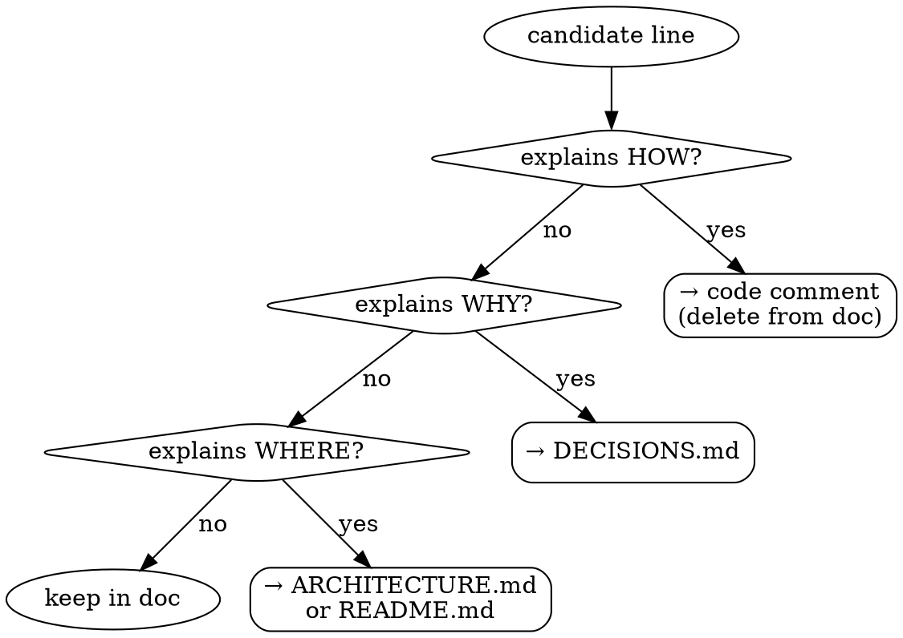

# Lean Doc Generator

Create or update project documentation using the Lean Documentation Standard.

Full standard: `${CLAUDE_SKILL_DIR}/reference/DOCS_Guide.md`
Validated patterns: `${CLAUDE_SKILL_DIR}/reference/VALIDATED_PATTERNS.md`

## Invocation Modes

| Mode | Command | Output |
|:-----|:--------|:-------|
| Phase 8 session update | `/lean-doc-generator` | Update all docs touched this session |
| Init scaffold | `/lean-doc-generator init` | Full `docs/` scaffold for new project |
| Single doc | `/lean-doc-generator [type] [subject]` | One created or updated file |

## Doc Types and Line Limits

| File | Limit | Purpose |
|:-----|:------|:--------|
| `README.md` | 50 lines | What it is, how to adopt — no HOW |
| `docs/ARCHITECTURE.md` | 150 lines | WHERE things live — structure, dependency rule |
| `docs/DECISIONS.md` | unlimited | ADRs — WHY decisions were made |
| `docs/SETUP.md` | 100 lines | Commands only — how to run locally |
| `docs/AI_CONTEXT.md` | 100 lines | Stack + architecture context for Claude |
| `docs/CHANGELOG.md` | unlimited | Sprint history — append only |

## HOW Filter (mandatory before every line)

Ask: **"Does this line explain HOW the code works?"**

- HOW → delete it, put it in a code comment instead
- WHY → belongs in `docs/DECISIONS.md`
- WHERE → belongs in `docs/ARCHITECTURE.md` or `README.md`



## Ownership Header (required on every doc touched)

```yaml
---
owner: [role — not personal name]
last_updated: YYYY-MM-DD
update_trigger: [specific event that requires updating this file]
status: current | stale | deprecated
---
```

Procedure: `${CLAUDE_SKILL_DIR}/references/procedure.md`

## Red Flags

| Rationalization | Reality |
|:----------------|:--------|
| "This explains HOW it works, but it's useful context" | HOW content rots as code changes and costs line budget — move it to a code comment |
| "I'll raise the line limit just this once" | The limit IS the discipline — raising it means the HOW filter failed upstream |
| "This content doesn't quite fit HOW/WHY/WHERE — I'll leave it" | Everything fits one of the three: implementation detail → HOW, motivation → WHY, location → WHERE. No exception. |
| "This doc doesn't have an ownership header yet, but I'll add it later" | Every doc file you touch gets an updated ownership header before you leave it |

## Hard Rules

- Zero HOW content in any doc file.
- Every doc you touch must have an updated ownership header.
- `docs/DECISIONS.md` is append-only — never edit past ADRs.
- If `docs/` does not exist and mode is not `init` → hard stop, ask user to run `init` first.
- If any file would exceed its line limit after update → trim before adding new content.
