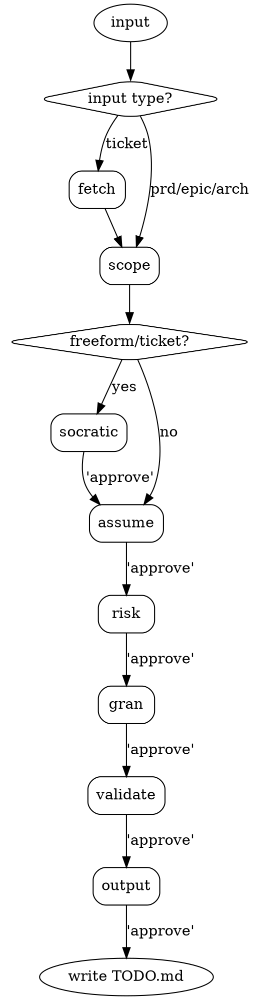

# Task Decomposer

Translate any form of human intent into fully-formed TASK-NNN entries. Output serves as Gate 0 — no separate Gate 0 runs after approval.

## Input Types

| Input | Example | Detection |
|:------|:--------|:----------|
| Freeform | `"add Google OAuth login"` | No URL, no `--` flag |
| Ticket | `JIRA-123` or Linear/GitHub URL | Matches URL or `[A-Z]+-[0-9]+` |
| PRD | `--prd docs/feature.md` | `--prd` flag + file path |
| Epic | `--epic "Payment"` | `--epic` flag + name |
| Architecture | `--from-architecture` | INIT mode Phase I-4 only |

## Decision Flow

Execution procedure: `${CLAUDE_SKILL_DIR}/references/procedure.md`

## Hard Rules

- Never write to TODO.md before human types `approve`
- `tracker: none` without written justification → prompt, do not proceed
- Identical acceptance criteria on two tasks → merge or differentiate before output
- `--from-architecture` skips clarification and assumption registry — uses Gate B doc as spec; if invoked outside INIT Phase I-4, state this and require explicit human confirmation before proceeding
- Missing ticket credentials → ask for paste; never block on missing env vars
- After `approve`: two writes occur — TODO.md **Backlog** insertion and `.claude/.session-changes.txt` clear; no other files are touched
- Never write tasks to Active Sprint — sprint formation happens via `/dev-flow rotate`

## Red Flags

| Rationalization | What it actually means |
|:----------------|:-----------------------|
| "I'll just guess the layers" | Guessing layers produces wrong risk scores and missed cross-layer impact — scope-analyst is not optional |
| "I'll just guess the acceptance criteria" | "Works correctly" fails validation — write the observable outcome |
| "This is small, skip the assumption registry" | Unconfirmed auth assumptions are the top source of security regressions |
| "Four questions is too many, I'll ask all at once" | Stacked questions produce vague answers — one at a time forces precision |
| "These two tasks are related, I'll merge them" | Related ≠ same concern — verify acceptance criteria are truly identical first |
