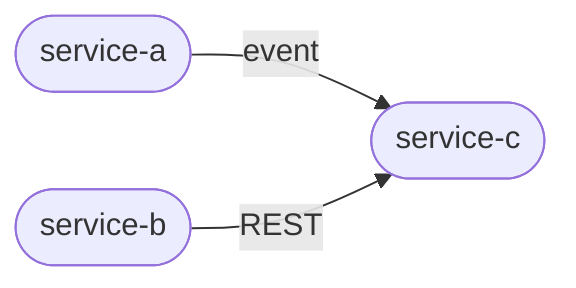

# LEAN DOCUMENTATION STANDARD

> Universal Baseline for Any Development System
> *Technology-Agnostic · Multi-Service Ready · AI-Aware · Scalable*
>
> Version 1.0 — Foundation Edition

---

## Table of Contents

| #  | Section                              |
| :- | :----------------------------------- |
| 1  | [Philosophy & Core Rules](#1-philosophy--core-rules) |
| 2  | [Universal Doc Structure (5 Core Files)](#2-universal-documentation-structure) |
| 3  | [File Specifications](#3-file-specifications) (3.1–3.8 incl. CHANGELOG.md + TEST_SCENARIOS.md) |
| 4  | [Multi-Service Architecture](#4-multi-service-architecture) |
| 5  | [Lifecycle Rules](#5-lifecycle-rules) |
| 6  | [Ownership Model](#6-ownership-model) |
| 7  | [Format Standards (MD · YAML · JSON)](#7-format-standards) |
| 8  | [AI Context Layer](#8-ai-context-layer) |
| 9  | [Tiered Scale Model](#9-tiered-scale-model) |
| 10 | [Anti-Patterns & Enforcement](#10-anti-patterns--enforcement) |

---

# 1. Philosophy & Core Rules

## The Fundamental Law

Code is the source of truth for HOW. Documentation exists only to explain WHY and WHERE. Every doc that answers HOW is a liability — it will drift from code and become a source of confusion.

### The Golden Rule

| If it explains…                  | → Action                                    |
| :------------------------------- | :------------------------------------------ |
| HOW something works              | Put it in code (comments, types, tests)     |
| WHY a decision was made          | Put it in DECISIONS.md                      |
| WHERE things live                | Put it in ARCHITECTURE.md or README.md      |
| You are unsure                   | Put it in code                              |

## The 4 Laws of Lean Documentation

| Law   | Name               | Description |
| :---- | :----------------- | :---------- |
| LAW 1 | Minimal by Default | No document is created unless it solves a real, recurring pain. Every new doc must pass the question: *would the absence of this file cause repeated interruptions or mistakes?* |
| LAW 2 | Owned, Not Shared  | Every document has exactly one owner role. Shared ownership means no ownership. The owner is responsible for accuracy, not just creation. |
| LAW 3 | Lifecycle-Bound    | Every document has a defined trigger to create, update, and archive it. Docs without lifecycle rules inevitably go stale. |
| LAW 4 | Signal-Dense       | Every line in a document must carry unique information not already in the code. If a doc is repeating what code already says, delete that section. |

---

# 2. Universal Documentation Structure

This structure applies to any system — web, mobile, backend service, data pipeline, embedded firmware, or platform tooling. The file names and purposes are fixed. The content inside scales to the complexity of your system.

### Universal Directory Structure

```
/docs (or root of repo)
├── README.md            Navigation hub — start here
├── ARCHITECTURE.md      System design — the big picture
├── DECISIONS.md         Architectural decisions — why, not how
├── SETUP.md             Getting running — for humans and CI
├── AI_CONTEXT.md        Machine-readable context for AI assistants
├── TODO.md              Backlog + active sprint pointer + quick rules (Tier 2+)
├── CHANGELOG.md         Sprint pointer index — append-only, newest first (Tier 2+)
├── TEST_SCENARIOS.md    Test coverage map, gap analysis, completion roadmap (Tier 2+)
└── sprint/              Per-sprint files — plan + execution log + retro (Tier 2+)
    └── SPRINT-NNN-<slug>.md

/[service-or-module]/
└── README.md (optional) 10-line module guide
```

### The 5 Core Files — Quick Reference

| File              | Primary Reader         | Max Size              | Update Trigger                |
| :---------------- | :--------------------- | :-------------------- | :---------------------------- |
| README.md         | New dev / anyone       | 50 lines              | Project scope changes         |
| ARCHITECTURE.md   | Tech lead / senior dev | 150 lines             | Major structural change       |
| DECISIONS.md      | Team / future self     | Unlimited (ADR entries) | Every significant decision  |
| SETUP.md          | New dev / CI/CD        | 100 lines             | Setup process changes         |
| AI_CONTEXT.md     | AI assistant / LLM     | 100 lines             | Patterns or conventions change |
| TODO.md           | Dev / AI (every session) | Unlimited           | Backlog change · sprint promote · sprint close |
| CHANGELOG.md      | Reviewer / auditor     | Unlimited (append-only) | Sprint closed (one pointer block per sprint) |
| TEST_SCENARIOS.md | Dev / QA / AI          | Unlimited             | New test added, coverage gap found, suite restructured |
| docs/sprint/SPRINT-NNN-<slug>.md | Reviewer / AI mid-sprint | 400 lines hard cap | Continuous append during active sprint; retro filled at close |

> **RULE:** Before creating any new document outside these 9 files, ask:
> *"Can this information live in code comments instead?"*
> If YES → Add to code. If NO → Add to one of the core files above.

---

# 3. File Specifications

## 3.1 README.md — Navigation Hub

**Purpose:** Give any new team member a 5-minute orientation. It does not explain the system in depth — it points to where depth lives.

```markdown
# [System / Service Name]

One-sentence description of what this does and why it exists.

## Quick Start
[minimum commands to run this locally]

## What This System Does
[2-3 sentences on scope and boundaries]

## Key Directories / Modules
[map of where things live, 5-10 entries max]

## Documentation
- ARCHITECTURE.md — system design and patterns
- DECISIONS.md — key technical decisions
- SETUP.md — dev environment setup
- AI_CONTEXT.md — AI assistant context

## Ownership
Owner: [role or team] | Repo: [link] | Issues: [link]
```

## 3.2 ARCHITECTURE.md — System Design

**Purpose:** Explain the big picture — how components relate, what patterns are in use, and how data flows. This is for people who need to understand the system before changing it.

**Load this file when:** touching service boundaries, changing data flow, reviewing security model, adding or removing integrations, or evaluating cross-component impact of a change. Do not load for routine feature work within a single component — use `AI_CONTEXT.md` instead.

```markdown
# Architecture Overview
# Load trigger: service boundaries · data flow · security · integrations
# For pattern reference only → use AI_CONTEXT.md §Patterns instead

## System Context
[ASCII or Mermaid diagram showing system boundaries and external dependencies]

## Component Map
[List of major components/services and their single responsibility]

## Key Patterns
[Named patterns in use — e.g., CQRS, Event Sourcing, Saga, Repository]
[For each: name, where it's used, link to example in code]

## Data Flow
[How data moves through the system for the 2-3 most critical flows]

## Integration Points
[External systems, APIs, queues this system depends on or exposes]

## Security Boundaries
[Auth mechanism, trust boundaries, sensitive data locations]

## Reference Files
[Specific file paths that are canonical examples of patterns above]
```

## 3.3 DECISIONS.md — Architectural Decision Records (ADR)

**Purpose:** Capture WHY a decision was made so future developers don't reverse it for the wrong reasons, and don't repeat the same investigation. Each entry is an ADR (Architectural Decision Record).

```markdown
## ADR-[NNN]: [Short descriptive title]

Date: YYYY-MM-DD
Status: Proposed | Accepted | Deprecated | Superseded by ADR-NNN
Owner: [role]

### Context
What problem were we solving? What options were evaluated?

### Decision
What did we decide?

### Rationale
Why this option over the alternatives? What data or principles drove this?

### Consequences
What does this make easier? What does this make harder?
+ Positive outcome
- Trade-off or cost

### Reference
Where is this implemented in code?
```

**WHEN TO WRITE AN ADR:**

- Choosing between two or more non-trivial technical options
- Adopting a new pattern, framework, or tool team-wide
- Reversing or superseding a previous decision
- Making a trade-off that will constrain future choices

**WHEN NOT TO WRITE AN ADR:**

- Implementation details that can change without architectural impact
- Choices that only affect one module and have no team-wide ripple

## 3.4 SETUP.md — Getting Started

**Purpose:** Take any developer (or CI/CD system) from zero to running in under 10 minutes. Every step must be executable. No ambiguity. No assumptions.

```markdown
# Development Setup

## Prerequisites
[Tool name + minimum version for each dependency]

## Quick Start
[Numbered, executable steps — each must be a single command or clear action]
1. [step]
2. [step]
3. [step]

## Configuration
[Required environment variables or config files — include example values]

## Verification
[How to confirm setup succeeded — expected output or health check]

## Common Issues
[Most frequent setup failures with exact fix for each]

## Useful Commands
[Cheatsheet of day-to-day dev commands]
```

## 3.5 AI_CONTEXT.md — AI Assistant Context

**Purpose:** Provide an AI coding assistant with the minimum context to be immediately productive on this codebase. Token-efficient. Machine-readable. Updated when conventions change.

This file serves as **L1 context** in the load hierarchy — loaded after README.md (L0), before opening ARCHITECTURE.md or DECISIONS.md (L2). Every section is optimized for signal density. No prose. No HOW explanations.

```markdown
# AI Context — [System Name]
# MAX 100 LINES. Every line must be unique signal.

## Context Abstract
system: [what this system is — one sentence max]
phase: [current development phase — e.g. MVP, active, maintenance]
stack: [key technologies, comma-separated]
load_next: [which L2 file to open next — e.g. "ARCHITECTURE.md if touching service boundaries"]

## Context Load Order
# Load in this sequence. Stop when you have enough context for the task.
# L0 → README.md          (50 lines) — orientation, entry point, quick links
# L1 → AI_CONTEXT.md     (this file) — patterns, conventions, current focus, routing
# L2 → ARCHITECTURE.md   (150 lines) — load if: touching service structure, data flow, security
# L2 → DECISIONS.md      (unlimited) — load if: need to know WHY a pattern or tool was chosen
# L2 → SETUP.md          (100 lines) — load if: environment, config, or onboarding questions
# Never load all L2 files at once. Load only the one relevant to the current task.

## Navigation Guide
# Route your query to the right file before reading anything else.
| Question type                              | Start here         | Then if needed       |
|:-------------------------------------------|:-------------------|:---------------------|
| What does this system do?                  | README.md          | AI_CONTEXT.md §Identity |
| How do I run / set up locally?             | SETUP.md           | —                    |
| Which pattern should I use for X?          | AI_CONTEXT.md §Patterns | ARCHITECTURE.md |
| Why was technology / tool Y chosen?        | DECISIONS.md       | —                    |
| How do services/components connect?        | ARCHITECTURE.md    | DEPENDENCY_MAP.md    |
| What are the auth / security boundaries?   | ARCHITECTURE.md §Security | DECISIONS.md  |
| What is the current sprint focus?          | TODO.md            | —                    |
| What should I NOT do in this codebase?     | AI_CONTEXT.md §Do Not | DECISIONS.md     |

## Doc Scope Map
# What exclusively lives in each file. Never duplicate across files.
README.md:               navigation hub, quick start commands, doc links — nothing else
AI_CONTEXT.md:           patterns, conventions, business rules, do-nots, current focus
ARCHITECTURE.md:         component map, data flows, security boundaries, integration points
DECISIONS.md:            ADR entries only — context + decision + rationale + consequences
SETUP.md:                prerequisite tools, step-by-step setup commands, env vars, verification
TODO.md:                 backlog (raw lines) + active sprint pointer + quick rules — NO inline plan, NO changelog
docs/sprint/SPRINT-*.md: per-sprint plan + execution log + files changed + decisions + open questions + retro (review source of truth)
CHANGELOG.md:            sprint pointer index — one block per sprint linking to sprint file. NO file-by-file detail
TEST_SCENARIOS.md:       coverage map, gap analysis, completion roadmap

## Identity
system: [what this system is in 1 line]
type: [service | monolith | library | pipeline | platform]
language: [primary language(s)]

## Structure
[path]: [1-line description of what lives here]
[path]: [1-line description]

## Patterns
[pattern name]: [where used] — see [file path]
[pattern name]: [where used] — see [file path]

## Conventions
naming: [file naming convention]
[language-specific conventions: e.g. error handling, return types]
[test co-location rule]

## Business Rules
[key domain rule 1]
[key domain rule 2]

## Do Not
[anti-pattern 1 specific to this codebase — reference ADR if applicable]
[anti-pattern 2]

## Current Focus
done: [recently completed]
active: [in progress]
next: [planned]
```

## 3.6 TODO.md — Backlog + Active Sprint Pointer (Tier 2+)

**Purpose:** Single entry point for what's queued and what is being worked on right now. TODO.md does NOT hold sprint plans, execution logs, or changelogs — those live in `docs/sprint/SPRINT-NNN-<slug>.md` (per sprint) and `CHANGELOG.md` (history). TODO.md is a thin index: backlog + pointer to active sprint file + condensed quick rules.

```markdown
# [Project Name] Development Tracker

> **How to use this file**
> - **Start of session** — read this file first. If `Active Sprint` points to a sprint file, read that file next.
> - **Promote backlog → sprint** — pick top backlog items → run Sprint Promote Protocol → write `docs/sprint/SPRINT-NNN-<slug>.md` → set Active Sprint pointer below → commit `sprint(NNN): plan locked`.
> - **During sprint** — append all execution detail to the sprint file (Execution Log + Files Changed). Do NOT log task progress here.
> - **Close sprint** — run Sprint Close Protocol → update relevant docs → write pointer row in `CHANGELOG.md` → squash-commit `sprint(NNN): <summary>` → clear Active Sprint pointer.
> - **Every ADR added** — bump ADR count in README.md and AI_CONTEXT.md.
> - **Docs to keep in sync**: `README.md` · `ARCHITECTURE.md` · `DECISIONS.md` · `AI_CONTEXT.md` · `TEST_SCENARIOS.md`

---

## Active Sprint

→ [docs/sprint/SPRINT-NNN-<slug>.md](sprint/SPRINT-NNN-<slug>.md)  *(or "— none —" when no sprint active)*

---

## Backlog

### P1 — [Phase] Required

- [ ] **[Task]** — [why it matters]

### P2 — Quality / Polish

- [ ] **[Task]** — [why it matters]

### P3 — Post-[Phase]

- [ ] **[Task]** — [why it matters]

---

## Quick Rules
> Condensed from docs — use when writing code so you don't need to open ARCHITECTURE.md.

\`\`\`
[key rules: auth patterns, naming, amounts, cache, colors, etc.]
\`\`\`
```

**LIFECYCLE RULES:**
- TODO.md does NOT contain inline sprint plans. Plans live in `docs/sprint/SPRINT-NNN-<slug>.md`.
- TODO.md does NOT contain a Changelog section. Changelog lives in `CHANGELOG.md` (one pointer row per sprint, never inline detail).
- Backlog items = raw one-liners. Decomposition (acceptance / files / risk / DoD / confidence) happens at sprint promote time, written into the sprint file, NOT here.
- Only one sprint may be `status: active` at a time. Active Sprint pointer = exactly one path or `— none —`.
- Promoted tasks are removed from Backlog at promote time, not at close.

**README.md link rule:** When TODO.md exists, README.md must include a "Working on This Project" section with `TODO.md` as "**Start here every session →**". This makes it the doc-system entry point for every new AI session and developer.

## 3.7 CHANGELOG.md — Sprint Pointer Index (Tier 2+)

**Purpose:** Permanent, append-only **pointer index** of every closed sprint. One block per sprint. Each block links to the sprint file (the actual source of truth for review). CHANGELOG.md does **NOT** contain file-by-file change tables — that detail lives in `docs/sprint/SPRINT-NNN-<slug>.md` forever and should never be duplicated here.

**Population protocol:** On sprint close (Step 9 Sprint Close Protocol):
1. Verify sprint file `status: closed` and Retro filled
2. Verify ARCHITECTURE.md / DECISIONS.md / AI_CONTEXT.md / TEST_SCENARIOS.md updated
3. Prepend a pointer block to CHANGELOG.md (newest first)
4. Clear `Active Sprint` pointer in TODO.md to `— none —`

```markdown
# Changelog — [Project Name]

---
owner: Tech Lead
last_updated: YYYY-MM-DD
update_trigger: Sprint closed (Step 9 Sprint Close Protocol)
status: current
---

> Sprint pointer index — newest sprint first. Click sprint file link for full plan / execution log / files-changed table / decisions / retro.
> CHANGELOG.md never contain file-by-file detail — that live in the linked sprint file.

---

## Sprint N — [Sprint Theme] (YYYY-MM-DD)

- Sprint file: [docs/sprint/SPRINT-NNN-<slug>.md](sprint/SPRINT-NNN-<slug>.md)
- PRD: [external link or ticket id]
- Plan commit: <plan_sha>
- Close commit: <close_sha>
- Summary: [one line — what shipped]
- Docs updated: [list, e.g. ARCHITECTURE.md §Auth, AI_CONTEXT.md §Patterns]
- ADRs: ADR-NNN, ADR-MMM (or —)
- Files changed: NN
- Tests added: NN

---
```

**Rules:**
- Append-only — never delete or edit past pointer blocks
- Newest sprint always at the top
- One pointer block per sprint — no prose, no file tables
- File-by-file detail belong in sprint file, NOT here. CHANGELOG = index of sprints, not log of changes
- Load tier: L3 — load only when auditing history or onboarding, never for routine sessions

## 3.9 docs/sprint/SPRINT-NNN-<slug>.md — Per-Sprint File (Tier 2+)

**Purpose:** Source of truth for one sprint, end-to-end. Holds the frozen plan, the running execution log, the files-changed table, the decisions made, the open questions for the reviewer, and the retro. This is the file a reviewer reads before the diff to understand WHY each change was made.

**Lifecycle:** `planning` → `active` → `closed`. Plan section frozen at kickoff. Execution Log / Files Changed / Decisions / Open Questions append-only during sprint. Retro filled at close.

**One file per sprint. Multiple sprints per PRD allowed (when PRD complex).** External PRD only — no in-repo PRD doc type. Sprint file `prd:` field = link or ticket id.

**Naming:** `SPRINT-NNN-<slug>.md` where NNN is zero-padded global counter (001, 002, …) and `<slug>` is kebab-case theme ≤30 chars.

```markdown
# Sprint NNN — [theme]

---
owner: Tech Lead
status: planning | active | review | closed
prd: [external link or ticket id]
sprint_window: YYYY-MM-DD → YYYY-MM-DD
plan_commit: <sha>      # filled when plan locked
close_commit: <sha>     # filled at sprint close
last_updated: YYYY-MM-DD
update_trigger: status change · execution log append · close
---

## Context
[3 lines max — what feature, what slice of PRD, what carries from previous sprint]

## Plan (frozen at kickoff — do not edit after status: active)

### T1 — [task name]
- **Why:** [reason this matters]
- **Acceptance:** [observable, testable outcome]
- **Files (likely):** [paths or "tbd — see Surprise log"]
- **Tests:** [scenarios to add → TEST_SCENARIOS.md]
- **Risk:** low | med | high — [reason]
- **Depends on:** T0 | —
- **ADR needed:** yes | no | maybe — [topic]
- **DoD:** code merged + tests green + [docs to update]
- **Confidence:** NN% — [uncertainty area]

### T2 — ...

## Execution Log (append-only)

### YYYY-MM-DD HH:MM | T1 started
[brief context, key decision]

### YYYY-MM-DD HH:MM | Surprise during T1
[unexpected finding, plan deviation, resolution]

### YYYY-MM-DD HH:MM | T1 done
[acceptance verified, DoD ticked]

## Files Changed

| File | Task | Change | Risk | Test added |
|:-----|:-----|:-------|:-----|:-----------|
| `path/to/file` | T1 | [one-line WHY] | low | `path/to/test.ts` or — |

## Decisions

- [decision] — [reason] [→ ADR-NNN if global, else sprint-local]

## Open Questions for Review

- [ ] [question for reviewer before merge]

## Retro (filled at sprint close)

- **Worked:** [what flow good]
- **Friction:** [what slow / wrong assumption]
- **Pattern candidate:** [rule worth permanent — confirm with user before write to Validated Session Patterns]
```

**Rules:**
- Hard cap 400 lines. >400 = sprint too big, split into N sprints under same PRD.
- Plan section frozen post `status: active`. Deviation → log in Execution Log § Surprise. Editing frozen Plan = block.
- HOW prose / code dumps / function explanations forbidden. Sprint file = WHY/WHERE only.
- Files Changed table must cover every file in `git diff` since `plan_commit`. Sprint Close (Step 9) verifies this.
- Retro mandatory before status flip to `closed`. Empty Retro = block close.
- One sprint may be `status: active` at a time per repo. Block promote of new sprint until current closed.
- Load tier: L2 conditional — load only the active sprint file. Closed sprint files = L3 (load only when query reference past sprint).

## 3.8 TEST_SCENARIOS.md — Test Coverage Map (Tier 2+)

**Purpose:** Single source of truth for what is tested, what is not, and what is planned. Used by AI to avoid suggesting tests that already exist, and by developers to identify coverage gaps before sprints.

```markdown
# Test Scenarios — [Project Name]

---
owner: Tech Lead
last_updated: YYYY-MM-DD
update_trigger: New test added, coverage gap closed, suite restructured
status: current
---

## Infrastructure

| Tool | Purpose |
|:-----|:--------|
| [test framework] | unit + integration tests |
| [e2e framework] | end-to-end browser tests |

## Coverage Map

### Unit Tests — [path/]

| File | Scenarios | Notes |
|:-----|:----------|:------|
| `path/to/test.ts` | [N] cases: [brief list] | — |

### E2E Tests — [path/]

| File | Scenarios | Notes |
|:-----|:----------|:------|
| `path/to/spec.ts` | [N] flows: [brief list] | — |

## Gap Analysis

| Area | Gap | Priority |
|:-----|:----|:---------|
| [module] | [what's missing] | P0/P1/P2 |

## Completion Roadmap

- [ ] **[Task]** — [why it matters]
```

---

# 4. Multi-Service Architecture

When a system grows beyond a single service, the documentation must reflect that architecture. The pattern used here is: **Centralized Registry + Lean Per-Service docs**. The registry is the single source of truth for service relationships. Each service owns its own 5-file set.

## 4.1 Directory Structure

```
/registry/                          ← SYSTEM-LEVEL (centralized)
    ├── SERVICE_REGISTRY.md         Master list of all services
    ├── SERVICE_REGISTRY.yaml       Machine-readable version
    ├── DEPENDENCY_MAP.md           Inter-service dependency graph
    └── GLOBAL_DECISIONS.md         Cross-service architectural decisions

/services/
    ├── service-a/                  ← SERVICE-LEVEL (lean per-service)
    │   ├── README.md
    │   ├── ARCHITECTURE.md
    │   ├── DECISIONS.md
    │   ├── SETUP.md
    │   └── AI_CONTEXT.md
    ├── service-b/                  [same 5 files]
    └── service-c/                  [same 5 files]
```

## 4.2 SERVICE_REGISTRY.yaml (Machine-Readable)

The registry YAML is the canonical reference for all tooling, AI context, and onboarding. Every service must have an entry. This file is the first thing an AI assistant or new developer reads about the overall system.

```yaml
# SERVICE_REGISTRY.yaml
# Updated by: Tech Lead | Trigger: any service added, deprecated, or changed

system:
  name: [System Name]
  version: 1.0.0
  updated: YYYY-MM-DD
  owner: [team or role]

services:
  - id: service-a
    name: Human-readable name
    status: active  # active | deprecated | experimental
    responsibility: >
      One sentence. What does this service own exclusively?
    language: go
    port: 8080
    repo: https://[link]
    docs: /services/service-a/
    owner: backend-team
    depends_on: [service-b, service-c]
    exposes:
      - type: REST
        path: /api/v1/resource
      - type: event
        topic: resource.created
    consumes:
      - type: event
        topic: other.updated

  - id: service-b
    name: ...
    # [same structure]
```

## 4.3 DEPENDENCY_MAP.md

Documents which services call which. Critical for impact analysis before any change. Keep as an ASCII diagram plus a dependency table.

```markdown
# Dependency Map
# Last updated: YYYY-MM-DD

## Diagram
[service-a] —REST—> [service-b]
[service-a] —event—> [service-c]
[service-b] —REST—> [service-c]
```



### Dependency Table

| Service   | Depends On | Type  | Why                      |
| :-------- | :--------- | :---- | :----------------------- |
| service-a | service-b  | REST  | Needs B to validate X    |
| service-a | service-c  | event | Notifies C of changes    |
| service-b | service-c  | REST  | Looks up C for Y         |

### Change Impact Guide

- Changing service-c API → impacts: service-a, service-b
- Changing service-b API → impacts: service-a

> **RULE:** If you add, deprecate, or rename a service, you must update:
> 1. SERVICE_REGISTRY.yaml (same day)
> 2. DEPENDENCY_MAP.md (same day)
> 3. GLOBAL_DECISIONS.md (if a decision drove the change)
>
> Stale registry = broken onboarding for every new developer and AI session.

---

# 5. Lifecycle Rules

The most common documentation failure is docs that exist but are never updated. Lifecycle rules define the exact triggers for creating, updating, and archiving every document type. These rules must be enforced in code review and sprint ceremonies.

| Document               | Create When                        | Update When                                   | Archive When              |
| :--------------------- | :--------------------------------- | :-------------------------------------------- | :------------------------ |
| README.md              | Repository created                 | Scope, stack, or entry points change          | Repo is decommissioned    |
| ARCHITECTURE.md        | Second major component added       | Structural pattern or major component changes | Service retired           |
| DECISIONS.md (ADR)     | Non-trivial option comparison      | Decision is superseded or status changes      | Never — archive by status |
| SETUP.md               | First external contributor joins   | Prerequisite, config, or step changes         | Repo decommissioned       |
| AI_CONTEXT.md          | First AI-assisted dev session      | Convention, pattern, or focus area changes    | Service retired           |
| TODO.md                | Second developer joins or sprint planning begins | Backlog change · sprint promote · sprint close (pointer flip) | Repo decommissioned |
| CHANGELOG.md           | First sprint closed                | Sprint closed — prepend pointer block (Step 9 Sprint Close) | Never — append-only |
| TEST_SCENARIOS.md      | First test suite added             | New test added, coverage gap closed, suite restructured | Repo decommissioned |
| docs/sprint/SPRINT-NNN-<slug>.md | Sprint Promote (Step 7) | Continuous append during active sprint (execution log, files changed, decisions, surprises); Retro filled at close | Never — historical record per sprint |
| SERVICE_REGISTRY.yaml  | Second service exists              | Any service added, changed, or deprecated     | System decommissioned     |
| DEPENDENCY_MAP.md      | First inter-service dependency     | Any dependency added, changed, or removed     | System decommissioned     |

## 5.1 Enforcement Points

Lifecycle rules only work if they are enforced at specific points in the development process. These are the mandatory checkpoints:

- **Pull Request / Code Review:** Reviewer checks if merged code changes require a doc update. If yes, the PR must include the doc update or a linked follow-up ticket created before merge.
- **Sprint Planning:** For any task that introduces a new service, pattern, or architectural change — a doc update subtask is created alongside the development task.
- **Sprint Retrospective:** A 5-minute doc health check. Are any docs known to be stale? Who owns fixing them?
- **Onboarding:** Every new developer runs through SETUP.md and reports any step that failed or was confusing. The owner updates SETUP.md within 24 hours of the report.

---

# 6. Ownership Model

Shared ownership is no ownership. Every document must have one role assigned as owner. The owner is not just the creator — they are accountable for the document's accuracy for the lifetime of that document.

## 6.1 Role-Based Ownership Map

| Document              | Owner Role                  | Reviewer Role      | Review Frequency       |
| :-------------------- | :-------------------------- | :----------------- | :--------------------- |
| README.md             | Tech Lead                   | Any team member    | Each major release     |
| ARCHITECTURE.md       | Tech Lead / Architect       | Senior developers  | Each structural change |
| DECISIONS.md          | Decision author             | Tech Lead          | On each new ADR        |
| SETUP.md              | Dev who last changed setup  | New joiners        | Each onboarding        |
| AI_CONTEXT.md         | Tech Lead                   | AI session reviewer | Each convention change |
| SERVICE_REGISTRY.yaml | Tech Lead                   | Service owners     | Each service change    |
| DEPENDENCY_MAP.md     | Tech Lead / Architect       | Service owners     | Each dependency change |
| Per-service README.md | Service owner               | Tech Lead          | Each service change    |

## 6.2 Ownership Header (Required in Every Doc)

Every document must include an ownership header as the first block after the title. This makes staleness visible at a glance.

```yaml
# OWNERSHIP HEADER (frontmatter block at top of every doc)
---
owner: [role, not person name]
last_updated: YYYY-MM-DD
update_trigger: [what event should cause this to be updated]
status: current | needs-review | stale
---
```

> **WHY ROLE, NOT PERSON NAME:**
> People change jobs. Roles persist. If you assign ownership to "Alice", the doc becomes ownerless when Alice leaves. Assign to "Tech Lead" or "Backend Team Lead" — whoever holds that role inherits the responsibility.

---

# 7. Format Standards

Three formats are used in this system. Each has a specific purpose. Never substitute one for another — the format signals intent to both humans and machines.

## 7.1 Markdown (.md) — Human-Readable Narrative

| USE FOR                           | AVOID FOR                                    |
| :-------------------------------- | :------------------------------------------- |
| Narrative explanation and context | Structured data with multiple fields         |
| ADR entries in DECISIONS.md       | Machine-parsed configuration                 |
| README, ARCHITECTURE, SETUP      | Data that needs to be queried programmatically |
| Human-readable tables (small)    | Deep nesting or complex hierarchies          |

### Markdown Rules

- Use ATX headers (`#` `##` `###`), never underline style
- ASCII diagrams preferred over external image links (stays in repo)
- Code blocks must specify language: `` ```yaml ``, `` ```go ``, `` ```sql ``
- Max heading depth: 3 levels (`###`). Deeper = restructure needed
- No HTML inside Markdown — keep it portable

## 7.2 YAML (.yaml) — Machine-Readable Structured Data

| USE FOR                                    | AVOID FOR                          |
| :----------------------------------------- | :--------------------------------- |
| SERVICE_REGISTRY — service metadata        | Long narrative text (use Markdown) |
| Dependency graphs and maps                 | Config that CI/CD already owns     |
| Any data consumed by tooling or scripts    | One-off lists that never get queried |
| Environment config schemas                 | Binary or non-text data            |

### YAML Rules

- Use 2-space indentation — never tabs
- Wrap multi-line strings with `>` (folded) or `|` (literal block)
- Use kebab-case for keys: `service-name` not `serviceName`
- Add a comment header: `# Updated by: [role] | Trigger: [event]`
- Validate with a schema (JSON Schema or custom) in CI

## 7.3 JSON (.json) — Interoperability & API Contracts

| USE FOR                                      | AVOID FOR                                   |
| :------------------------------------------- | :------------------------------------------ |
| API response contracts and schemas           | Human-maintained configuration (use YAML)   |
| JSON Schema validation definitions           | Narrative documentation                     |
| Generated output consumed by external tools  | Data with comments needed (JSON has no comments) |
| Event payload schemas                        | Files developers edit by hand frequently    |

### JSON Rules

- Never hand-write JSON for config — use YAML and convert in CI if needed
- Always pair with a JSON Schema (`.schema.json`) for validation
- Store schemas in `/schemas` or alongside the data they validate
- Use camelCase for keys to match API conventions
- Prettify with 2-space indent for human readability in repo

---

# 8. AI Context Layer

AI_CONTEXT.md is a first-class document, not an optional add-on. As AI-assisted development becomes standard practice, the quality of your AI context directly determines the quality of AI-generated code, reviews, and suggestions. A well-maintained AI_CONTEXT.md eliminates the repetitive overhead of re-explaining your system at the start of every AI session.

## 8.0 Context Load Hierarchy (L0 / L1 / L2)

This system implements a three-tier context loading model, aligned with the OpenViking context database philosophy. Every AI session should load context progressively — stopping at the tier that provides enough context for the task at hand.

| Tier | File | Token Budget | When to load |
|:-----|:-----|:-------------|:-------------|
| **L0** | `README.md` | ≤ 50 lines | Always — every session, first |
| **L1** | `AI_CONTEXT.md` | ≤ 100 lines | Always — every session, second |
| **L2** | `ARCHITECTURE.md` | ≤ 150 lines | Only when touching structure, boundaries, or data flow |
| **L2** | `DECISIONS.md` | Unlimited | Only when needing to understand WHY a choice was made |
| **L2** | `SETUP.md` | ≤ 100 lines | Only for environment, config, or onboarding questions |
| **L2** | `TODO.md` | Unlimited | Only for backlog state or to read Active Sprint pointer |
| **L2** | `docs/sprint/SPRINT-NNN-<slug>.md` (active only) | ≤400 lines | When the active sprint context is needed — task plan, decisions, files changed, open questions. Loaded only for the file with `status: active`. |
| **L2** | `TEST_SCENARIOS.md` | Unlimited | Only for test coverage questions, gap analysis, new test planning |
| **L3** | `CHANGELOG.md` | Unlimited | Only when auditing past changes, debugging regressions, or onboarding |
| **L3** | `docs/sprint/SPRINT-NNN-<slug>.md` (closed) | ≤400 lines | Only when query reference past sprint or cite reason for previous decision |

**Rule:** Never load all files at once. L0 + L1 is sufficient for 80% of coding tasks. L2 files are loaded on demand. L3 files are reference-only — never needed for routine feature work.

**Why this matters:** Loading ARCHITECTURE.md for every session wastes context window on structural detail irrelevant to the current task. The `## Context Load Order` block inside AI_CONTEXT.md is the machine-readable contract that enforces this hierarchy.

## 8.1 Context Abstract Block (Required First Section)

Every AI_CONTEXT.md must begin with a 4-line `## Context Abstract` block. This is the L0 entry point for the file itself — AI can scan these 4 lines to decide whether to load the full file.

```markdown
## Context Abstract
system: [what this system is — one sentence max]
phase: [current development phase]
stack: [key technologies, comma-separated]
load_next: [which L2 file to open if this file is insufficient]
```

This block must be updated whenever the phase changes or the stack changes. It is the single most-read section of the entire doc system.

## 8.2 Token Budget Rules

AI models have a finite context window. AI_CONTEXT.md must be optimized for signal density — maximum information per token consumed.

| Rule                  | Target                       | Why                                            |
| :-------------------- | :--------------------------- | :--------------------------------------------- |
| Max file length       | 100 lines                   | Fits in one context load without truncation    |
| Max line length       | 100 characters               | Readable without horizontal scroll             |
| No prose paragraphs   | Use structured `key: value`  | AI parses structured data more reliably        |
| No duplicated info    | If it's in code, reference the file | Every line must be unique signal        |
| No HOW explanations   | Only WHAT and WHERE          | HOW is in code — don't duplicate               |
| Current Focus section | Must be updated each sprint  | Guides AI to relevant context first            |

## 8.3 Multi-Service AI Context Strategy

In a multi-service system, never create one massive AI_CONTEXT.md covering everything. Use a two-level approach:

- **System-level** `AI_CONTEXT.md` in the registry root — covers cross-service patterns, shared conventions, and the overall system identity. Max 80 lines.
- **Service-level** `AI_CONTEXT.md` in each service — covers service-specific patterns, current focus, and that service's domain rules. Max 100 lines.

When starting an AI session on a specific service, load: system-level context first, then service-level context. This two-file approach uses ~150-180 lines versus a sprawling 500-line monolith that exceeds context windows.

## 8.4 The Do-Not Section

The most valuable part of AI_CONTEXT.md is the "Do Not" section. This prevents AI from suggesting patterns that have already been tried and rejected, or patterns that violate your system's constraints.

**Example:**

```markdown
## Do Not
- Do not use [pattern X] — decided against in ADR-003 (see DECISIONS.md)
- Do not add business logic to [layer Y] — violates our separation rules
- Do not create new tables without a migration file
- Do not call service-b directly from service-a — use the event bus
- Do not add dependencies without updating SERVICE_REGISTRY.yaml
```

---

# 9. Tiered Scale Model

Documentation requirements scale with system complexity. A solo developer starting a new project should not have the same documentation burden as a 30-person team maintaining 10 services. This tiered model defines exactly what is required at each stage of growth.

| Tier                    | Context                  | Required Docs                                                                           | Activation Trigger                        |
| :---------------------- | :----------------------- | :-------------------------------------------------------------------------------------- | :---------------------------------------- |
| **Tier 1 — Solo**       | 1-2 devs, 1 service     | README.md, SETUP.md, AI_CONTEXT.md                                                     | Project created                           |
| **Tier 2 — Small Team** | 2-5 devs, 1-3 services  | + ARCHITECTURE.md, + DECISIONS.md, + TODO.md, + CHANGELOG.md, + TEST_SCENARIOS.md     | Second dev joins or second service added  |
| **Tier 3 — Growing**    | 5-15 devs, 3-8 services | + SERVICE_REGISTRY.yaml, + DEPENDENCY_MAP.md, + Per-service AI_CONTEXT.md              | Third service or team split               |
| **Tier 4 — Scaled Org** | 15+ devs, 8+ services   | + GLOBAL_DECISIONS.md, + System-level AI_CONTEXT.md, + Ownership headers enforced in CI | Multiple teams owning different services  |

## 9.1 Scaling Rule

As your system grows, do NOT add more doc files of new types. Instead, do these things in order:

1. Make code more discoverable (better naming, better comments)
2. Add module-level README.md files (10 lines max, index only)
3. Activate the next tier's required docs from the table above

You should never need more than the Tier 4 set for any system. If you feel the urge to create a 9th document type, stop and ask: *"Is this a code problem I'm solving with a doc?"*

---

# 10. Anti-Patterns & Enforcement

These are the specific patterns that cause documentation systems to collapse. Recognizing them early — and having team-level rules against them — is what separates a system that stays lean from one that grows to 90 files.

## 10.1 Documentation Anti-Patterns

| Anti-Pattern      | Symptom                                          | Fix                                                       |
| :---------------- | :----------------------------------------------- | :-------------------------------------------------------- |
| How Documentation | Doc explains what the code does step by step     | Delete it. Add inline code comments instead.              |
| Orphan Docs       | File exists, no one updates it, no one reads it  | Delete or merge into core files.                          |
| Duplicate Truth   | Same info exists in doc AND code comment         | Remove from doc. Code comment wins.                       |
| Person Ownership  | Doc owned by "Alice" who left the team           | Reassign to role. Add ownership header.                   |
| Mega Doc          | One file with 500+ lines covering everything     | Split by concern. Enforce line limits.                    |
| Missing ADR       | A pattern exists but no one knows why            | Write retroactive ADR. Use "Status: Accepted (retroactive)". |
| Stale SETUP.md    | New dev can't run project from SETUP.md alone    | Owner updates within 24h of failure report.               |
| Registry Lag      | Service added but not in SERVICE_REGISTRY.yaml   | Block PR merge until registry is updated.                 |
| AI Context Bloat  | AI_CONTEXT.md exceeds 100 lines                  | Remove any line whose info is already in code.            |
| Screenshot Docs   | Architecture explained only in images            | Add ASCII diagram. Images can't be diffed or searched.    |
| Abandoned Tracker | Completed tasks accumulate in TODO.md Active Sprint | Active Sprint = pointer line only. Task progress logged in sprint file Execution Log, not here. |
| Missing Navigation Guide | AI_CONTEXT.md has no Navigation Guide or Doc Scope Map | Add §Navigation Guide and §Doc Scope Map — without these AI loads wrong files first, burning context window. |
| Unchallenged Stale Doc | Doc with `status: stale` or `status: needs-review` used as generation source | Always run Step 0 staleness scan. Flag stale docs before any generation begins. |
| HOW in Sprint File | Sprint file contains code dumps or function explanations | Strip. Sprint file = WHY/WHERE only. HOW go to code comments. |
| Frozen Plan Edited | Sprint file `## Plan` modified after `status: active` | Block edit. Plan immutable post-kickoff. Deviation → log in Execution Log § Surprise. |
| Sprint File Bloat | Sprint file > 400 lines | Sprint too big. Split into N sprints under same PRD. |
| CHANGELOG Detail Regression | CHANGELOG.md adds file-by-file table | Strip. CHANGELOG = pointer index only. Detail belongs in sprint file. |
| Concurrent Active Sprints | More than one sprint with `status: active` | Block. Only one active sprint allowed. Close current before promoting next. |
| Undecomposed Promotion | Backlog task promoted to sprint without acceptance / risk / DoD | Block. Run decompose clarify questions first (Step 7). |
| Closed Without Retro | Sprint `status: closed` with empty Retro section | Block close. Retro mandatory. |
| Orphan Sprint Pointer | TODO.md Active Sprint points to file with `status: closed` or non-existent | Reset pointer to `— none —` and surface to user. |

## 10.2 Enforcement Checklist (Code Review)

Add this checklist to your PR template. For any PR that involves code changes, reviewers check the applicable boxes.

```markdown
## Documentation Check (reviewer completes before approving)

- [ ] No new doc files created outside the 5 core + registry files
- [ ] If a new service was added → SERVICE_REGISTRY.yaml is updated
- [ ] If a new dependency was added → DEPENDENCY_MAP.md is updated
- [ ] If a significant technical decision was made → ADR added to DECISIONS.md
- [ ] If setup process changed → SETUP.md updated
- [ ] If a new code pattern was introduced → AI_CONTEXT.md updated
- [ ] If architecture changed → ARCHITECTURE.md updated
- [ ] All updated docs have ownership header with today's date
```

> If any box applies but is unchecked → PR is not ready to merge.

## 10.3 The Comparison

| BLOATED SYSTEM (Avoid)                          | LEAN SYSTEM (This Standard)                       |
| :---------------------------------------------- | :------------------------------------------------ |
| 90+ files across dozens of folders              | 5 core files + registry files only                |
| Docs explain HOW code works                     | Code explains HOW. Docs explain WHY and WHERE     |
| Ownership undefined — everyone and no one       | Every doc has one owner role                       |
| No lifecycle rules — docs go stale immediately  | Create/update/archive triggers defined per doc    |
| AI context is an afterthought                   | AI_CONTEXT.md is a first-class, maintained doc    |
| Same structure for solo dev and 30-person team  | Tiered model — activate docs as system grows      |
| Mixed formats with no clear purpose per format  | MD for narrative, YAML for structure, JSON for contracts |
| Onboarding takes days — docs contradict code    | Onboarding works in under 10 minutes              |

---

## Final Rule

A documentation system succeeds when new developers can understand what the system does, how to run it, and why key decisions were made — **within 30 minutes, without asking anyone.**

If that is not true for your system today, start with SETUP.md and work backwards. Fix the gap closest to the new developer first.

---

# 11. Pre-Delivery Checklist

Run this checklist before delivering any document from Step 6. If any box fails → fix before delivering.

**Universal (every document):**
- [ ] Ownership header present and complete (owner role, last_updated, update_trigger, status)
- [ ] No HOW explanations detected
- [ ] Line count verified against limit (count manually — do not estimate)
- [ ] Correct format (.md narrative · .yaml registries · .json contracts)
- [ ] No file types invented outside the allowed set
- [ ] All sections map to the file's template in §3
- [ ] Ownership assigned to a role, not a person name

**Stack & scope (from Step 5 answers):**
- [ ] Package manager matches Step 5 Q1 — never default to npm
- [ ] Dev infrastructure type matches Step 5 Q2
- [ ] No deferred-phase services appear as active dependencies (Step 5 Q3)

**TODO.md (if generated):**
- [ ] Active Sprint = pointer line OR `— none —`; NO inline plan; NO Changelog section
- [ ] README.md links to TODO.md as session entry point
- [ ] "How to use" header references Sprint Promote / Close protocols

**CHANGELOG.md (if generated):**
- [ ] Ownership header present; pointer-only format (no file-by-file table); newest sprint at top

**TEST_SCENARIOS.md (if generated):**
- [ ] Ownership header present; coverage map + gap analysis sections present

**Sprint file — at Promote:**
- [ ] Ownership header complete; status: planning OR active
- [ ] Plan section filled: every task has Why + Acceptance + Files + Tests + Risk + Depends + ADR-needed + DoD + Confidence
- [ ] Empty stub sections present for Execution Log / Files Changed / Decisions / Open Questions / Retro
- [ ] NO concurrent active sprint — only one with status: active
- [ ] Promoted tasks REMOVED from TODO.md Backlog

**Sprint file — at Close:**
- [ ] All task DoD items ticked [x]
- [ ] § Files Changed covers full git diff since plan_commit
- [ ] § Retro filled; status: closed
- [ ] CHANGELOG.md prepended with pointer row
- [ ] TODO.md Active Sprint cleared to `— none —`

**AI_CONTEXT.md (if generated):**
- [ ] 4-line `## Context Abstract` block at the very top (L0 entry point)
- [ ] `## Context Load Order` block declaring README → AI_CONTEXT → L2 files
- [ ] Context Load Order references active sprint file as L2 conditional load
- [ ] `## Navigation Guide` section with query routing table
- [ ] `## Doc Scope Map` section listing what exclusively lives in each file
- [ ] Doc Scope Map includes CHANGELOG.md, TEST_SCENARIOS.md, and docs/sprint/ if those exist

**ARCHITECTURE.md (if generated):**
- [ ] First section states which query types should trigger reading it (load trigger declaration)
